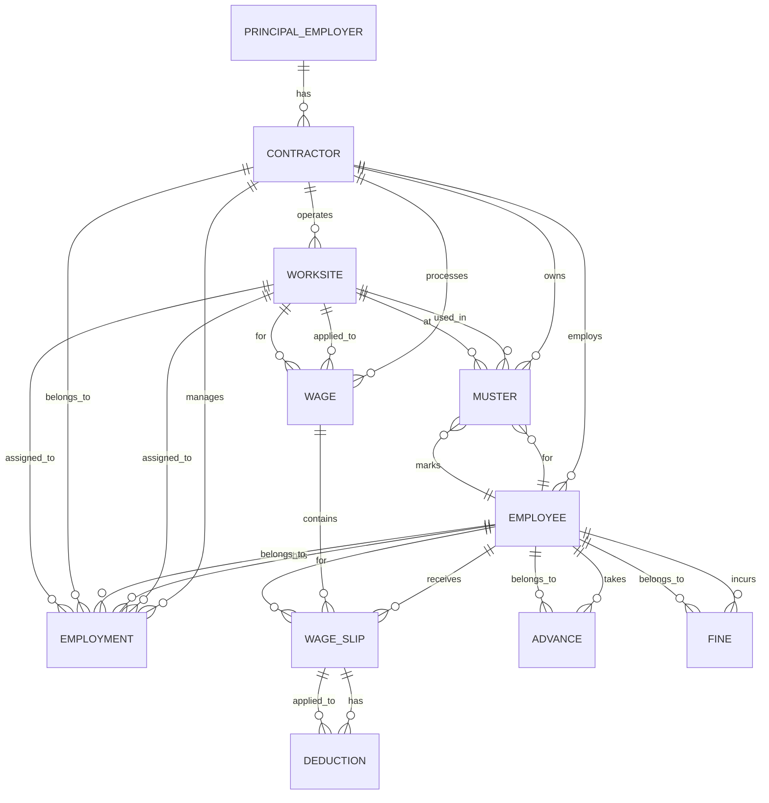

# Employee SaaS Backend (NestJS) Architecture

## 📦 Overview

This project models contractor-based workforce management inspired by government forms:

* Muster Roll (Form XVI)
* Wage Slip (Form XIX)
* Registers (Fines, Advances, Deductions)

The system is designed using **modular NestJS architecture** and **relational database modeling (TypeORM)**.

---

## 🧱 Modules

```
src/
 ├── principal-employer/   ✅ (NEW)
 ├── contractor/
 ├── worksite/             ✅ (NEW)
 ├── employee/
 ├── employment/
 ├── muster/
 ├── wages/
 ├── advances/
 ├── fines/
```

---

## 🧠 Core Entities

### 1. PrincipalEmployer

* Company for whom work is performed (e.g., JK Tyre)
* Can have multiple contractors

### 2. Contractor

* Works under a principal employer
* Manages employees and worksites

### 3. Worksite

* Physical location of work
* Shared across muster, wages, employment

### 4. Employee

* Worker details
* Linked to contractor

### 5. Employment

* Tracks employment duration
* Links employee + contractor + worksite

### 6. Muster (Attendance)

* Daily attendance tracking
* Source for payroll calculation

### 7. Wage

* Monthly payroll record
* Aggregated from muster

### 8. WageSlip

* Employee-level breakdown (Form XIX)

### 9. Deduction

* PF, ESI, penalties, etc.

### 10. Fine

* Register of fines

### 11. Advance

* Salary advances

---

## 🔗 Entity Relationships Diagram



---

## 📊 Data Flow

```
MUSTER → WAGE → WAGE SLIP → DEDUCTIONS
                     ↓
                ADVANCES / FINES
```

---

## 🏗 Module Responsibilities

### principal-employer

* Manage company details
* Link contractors

### contractor

* Manage contractor details
* Link employees and worksites

### worksite

* Manage work locations
* Used by muster, employment, wages

### employee

* Manage worker records

### employment

* Track employment lifecycle

### muster

* Attendance tracking (daily)

### wages

* Payroll processing
* Wage + WageSlip + Deduction logic

### advances

* Salary advances tracking

### fines

* Penalty tracking

---

## 📁 Suggested Folder Structure (Wages)

```
wages/
 ├── entities/
 │    ├── wage.entity.ts
 │    ├── wage-slip.entity.ts
 │    └── deduction.entity.ts
 ├── dto/
 ├── services/
 │    └── payroll.service.ts
 ├── wages.service.ts
 ├── wages.controller.ts
 └── wages.module.ts
```

---

## ⚡ Key Design Decisions

* WageSlip is **child of Wage** (not separate module)
* Deduction tightly coupled with WageSlip
* Muster drives payroll calculations
* Employee is central node across all modules
* PrincipalEmployer and Worksite modeled as independent entities for scalability

---

## 🧠 Scalability Notes

* Add `PayrollService` for complex calculations
* Use transactions for wage generation
* Index employeeId, contractorId, worksiteId
* Normalize deduction types if needed

---

## 🚀 Future Enhancements

* Multi-tenant support (per principal employer)
* Role-based access control
* Report generation (PDF for forms)
* Audit logs

---

## ✅ Summary

* Model real-world entities, not just form fields
* Keep tightly coupled entities in same module
* Use relations instead of duplication

---

Next step: build payroll engine + automated wage slip generation 🚀
